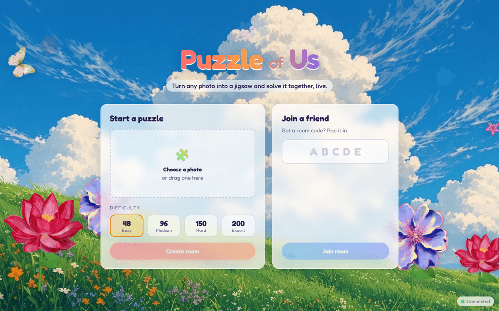
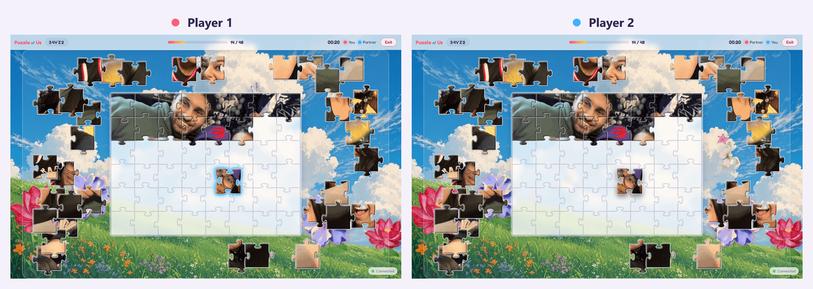
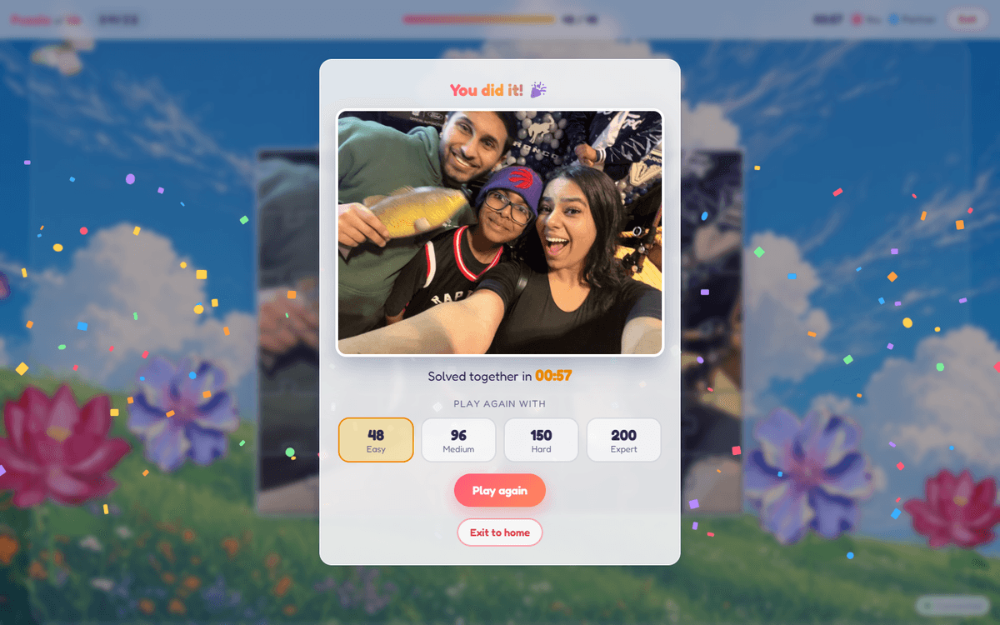
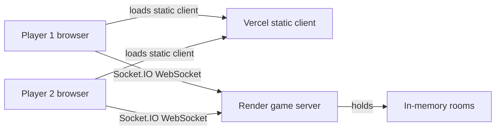

# Puzzle of Us

Turn any photo into a jigsaw puzzle and solve it together with a friend, live in the browser.

**Play it:** https://puzzle-of-us.vercel.app







## How to play

1. On the home screen, choose a photo, pick a difficulty (48, 96, 150 or 200 pieces) and click **Create room**.
2. Share the room link (or the 5-letter code) with your partner. The game starts as soon as they join.
3. The picture bursts apart into pieces scattered around the board. Only the slot outlines are shown, so neither of you sees the full photo until it is solved.
4. Drag pieces onto the board. A piece dropped close to its slot snaps in and locks. A piece dropped in the wrong spot jiggles and flies back to the pile. Pieces dropped off the board stay where you leave them.
5. You can both drag at the same time. A piece your partner is holding glows in their color and cannot be grabbed.
6. Each piece you snap in earns you 1 point; each wrong-spot drop costs 2. When the last piece snaps in, you see the photo, your time and who scored more, and can play again at any difficulty. Use **Exit** at any time to leave; your partner can keep going solo or invite someone else into the free seat.

## Features

- Real-time two-player play over WebSockets, with server-authoritative piece locking and snapping
- Jigsaw pieces with tabs cut deterministically from a shared seed, so both players see identical shapes
- Friendly competition: +1 for each piece you snap in, -2 for each wrong-spot drop (scores can go negative), shown live in the top bar with a floating +1 / -2, and the win screen crowns the winner or calls a tie
- Explosion intro, snap glow, wrong-drop jiggle and confetti on completion
- Reconnect and rejoin with the same link after a refresh or dropped connection
- Images are downscaled in the browser before upload; nothing is stored on disk, rooms live in memory
- Animated meadow background with butterflies, a hummingbird, drifting stars and swaying flowers (respects reduced motion)
- Works with mouse and touch, scales to any window size

## Tech stack

- **Client:** TypeScript, Vite, plain DOM and Canvas 2D (no framework), Socket.IO client
- **Server:** Node.js, Express 5, Socket.IO 4, run with tsx
- **Shared:** `shared/types.ts` holds the socket protocol, constants and layout math used by both sides

## Architecture

The static client is hosted on Vercel and connects to the game server on Render over Socket.IO. The server holds all room state in memory and decides every grab, snap and win.



## Local development

Requires Node.js 20.19 or newer.

```bash
npm install
npm run dev          # game server on :3000 and Vite on :5173 (or the next free port)
npm run test:server  # server smoke test: plays a full game with socket clients
npm run build        # production client build plus typecheck
```

In development Vite proxies `/socket.io` to the local server, so no environment variables are needed.

## Deployment

- **Render** (`render.yaml`): a free web service that runs `npm ci --include=dev && npm run build`, then `npm start`. Health check at `/healthz`. Set `ALLOWED_ORIGINS` to a comma-separated list of extra origins allowed to connect; the project's `puzzle-of-us.vercel.app` URLs are allowed by default.
- **Vercel** (`vercel.json`): builds the client with `npx vite build` and serves `client/dist` with a single-page rewrite. Set `VITE_SERVER_URL` to the Render URL (for example `https://puzzle-of-us.onrender.com`) at build time. If it is unset, the client connects to its own origin.
- Pushing to `main` redeploys both.
- The Render free tier sleeps after inactivity. The first visit can take up to a minute while the server wakes up; the client shows a "Waking up the puzzle server" banner and retries automatically.

## Project structure

```
client/
  index.html             screens: home, waiting room, game, win, modals
  public/decor/          background artwork
  src/
    main.ts              lobby, room flow and socket event handling
    net.ts               Socket.IO client and server URL
    puzzle/generate.ts   jigsaw cut generation and piece rendering
    puzzle/board.ts      board, dragging, animations
    background/          animated meadow background
    styles.css
server/
  src/index.ts           Express + Socket.IO server, CORS, health check
  src/rooms.ts           room and game logic
  test/smoke.ts          end-to-end smoke test
shared/types.ts          protocol, constants and layout helpers
scripts/process-decor.mjs  one-off tool that turned the decor art into transparent PNGs (uses sharp)
render.yaml              Render service config
vercel.json              Vercel build config
```
